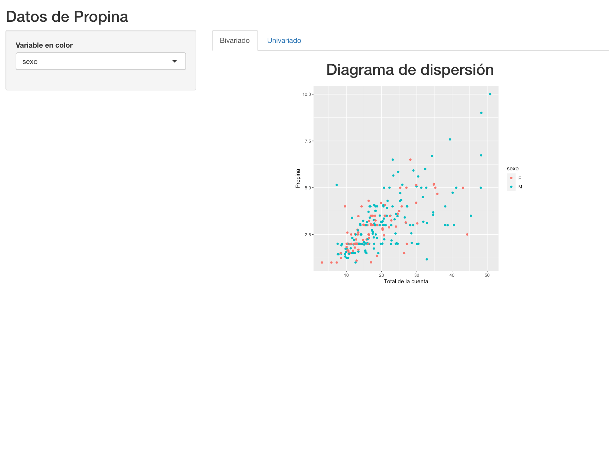
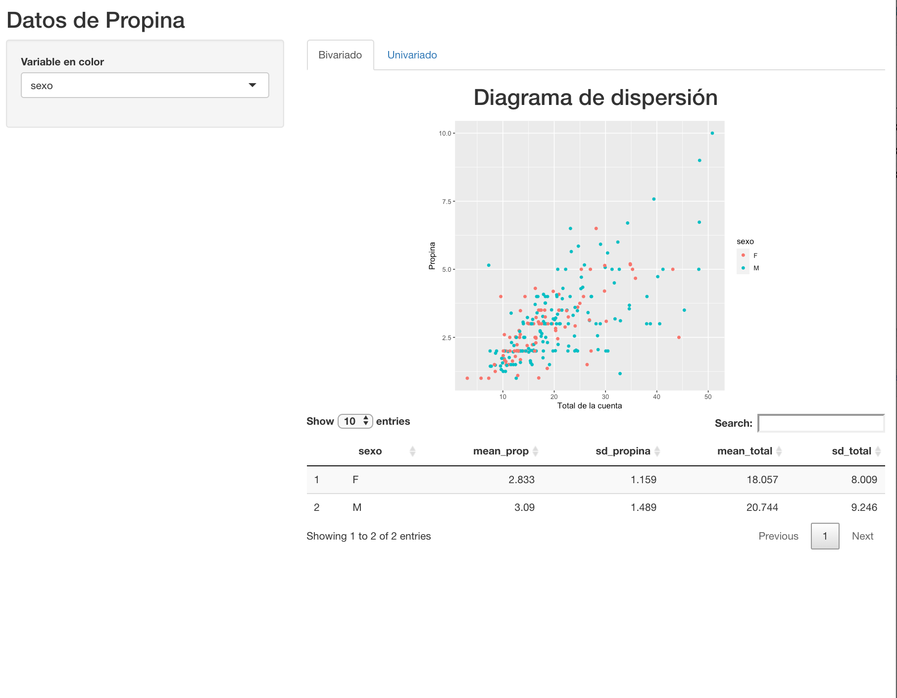
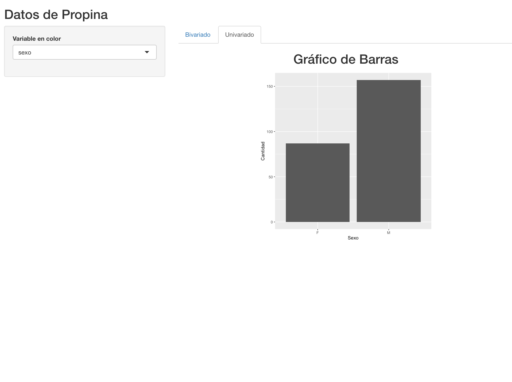

\newcommand{\m}{\ \newline\textcolor{blue}{Comentario: }\textcolor{red}}
\renewcommand\fbox{\textcolor{red}{Comentario: }\newline\fcolorbox{red}{white}}

```{r setup, include=FALSE}
knitr::opts_chunk$set(echo = TRUE, fig.pos = 'hbpt', out.extra = '', message = FALSE, warning = FALSE)
```


## Entrega 

Esta tarea tiene que estar disponible en su repositorio de GitHub con el resto de las actividades y tareas del curso el Viernes 23 de Junio.
Recordar seleccionar en en opciones de proyecto, codificación de código UTF-8.
La tarea es individual por lo que cada uno tiene que escribir su propia versión de la misma.
El repositorio debe contener tres archivos, un Rmarkdown con el código para cada parte (recordar poner en el entorno de código `eval=FALSE`), el archivo app.R con la applicación completa y los datos propina.csv para poder reproducir tus resultados clonando tu repo.
Para hacer esta tarea será necesario entender el concepto de "tidy evaluation" que se encuentra en el capítulo 12 de Mastering shiny y es lo que explica en nuestro caso porqué usamos `.data[[input$varcolor]]` en ggplot para cambiar el color de forma reactiva según la variable seleccionada.


## Ejercicio 1

Para este ejercio utilizaremos como arranque la shiny con los datos de propina vistos en clase y que colgamos en el servidor shinyapps.io.

```{r, eval=FALSE}

library(shiny)
library(tidyverse)

propinas <- read_csv("propina.csv" )

ui <- fluidPage(

  titlePanel("Datos de Propina"),
  sidebarLayout(
    sidebarPanel(
      selectInput('varcolor', 'Variable en color', 
                  c("sexo", "fuma", "dia", "momento") ) ),
    mainPanel( 
      h2("Diagrama de dispersión", align = "center"),
      plotOutput("scat" ) ) )
  )
  
server <- function(input, output){
  output$scat <- renderPlot({
  ggplot(data = propinas, 
         aes(x = total, y = propina, 
             colour = .data[[input$varcolor]] ))+
  geom_point() + theme(aspect.ratio = 1) + 
  scale_x_continuous(name ="Total de la cuenta") +
  scale_y_continuous(name = "Propina") 
 
})
}


shinyApp(ui, server)
```

0. Lea **TODOS** los pasos, en especial el 4to antes de armar su aplicación.

1. Crear dos pestañas una con el nombre Bivariado y la otra Univariado como se ve en la siguiente imagen



2. Crea en la pestaña Bivariado una tabla debajo de la figura que contenga  la media y el desvio de las variables propina y total agrupando por la variable de color (la tabla debe ser reactiva a la variable seleccionada), esto implica que la tabla debe modificarse cuando se selecciona una variable de color. Usar el paquete DT para hacer la tabla como se muestra en la siguiente imagen. 



2.1. Genera un selectInput llamado "digitos" que defina la cantidad de decimales a mostrar en la tabla anterior (0, 1 ó 2 decimales a mostrar). Para esto, agrega una linea extra en el calculo de la tabla que use la función across. Recordá que across solo puede usarse dentro de los verbos de dplyr, es decir, summarise(across(...)) sería la forma correcta. Tip: fijate que solo podes redondear variables númericas, la función where() es tu amiga (where y algo más...).


3. En la pestaña univariado hacé un gráfico de barras que sea reactivo a la selección de las variables sexo, fuma, dia y momento como se muestra en la siguiente imagen.



4. Generá dos botones de acciones (actionButton), el primero genera que se muestren los gráficos y tabla, el segundo que se borren los gráficos y tabla. [Mirá los siguientes ejemplos](https://shiny.rstudio.com/articles/action-buttons.html) y adaptalos para este ejercicio.


5. Subí tu aplicación a shinyiapps.io y compartí el link.

```{r eval=FALSE}
library(rsconnect)
library(here)
    rsconnect::deployApp(here("Tareas/Tarea4/app"))
```

[Mi Aplicación](https://ivan1arriola.shinyapps.io/tarea4)


6. **EXTRA**: Si el deber te pareció muy fácil, podrías agregar un conditionalPanel que se muestre cuando apretas el botón de generar los gráficos y se oculte cuando apretas el botón de borrar las gráficas (los actionButton del punto 4). Dentro del conditionalPanel podes agregar un actionButton que muestre u oculte la tabla que generaste.